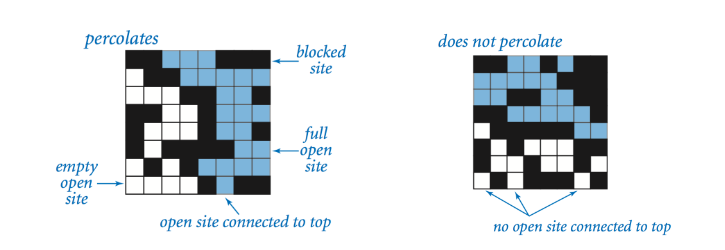

# Percolation Experiment 

This project uses Monte Carlo simulation and a strong union-find data structure to efficiently estimate the percolation threshold. Percolation is important in fields like materials science and network analysis, and our implementation aims to provide a precise estimation of the threshold value.

 

## Percolation

Given a composite systems comprised of randomly distributed insulating and metallic materials: what fraction of the materials need to be metallic so that the composite system is an electrical conductor? Scientists have defined an abstract process known as percolation to model such situations.

 

## The model

We model a percolation system using an n-by-n grid of sites. Each site is either open or blocked. A full site is an open site that can be connected to an open site in the top row via a chain of neighboring (left, right, up, down) open sites. We say the system percolates if there is a full site in the bottom row. In other words, a system percolates if we fill all open sites connected to the top row and that process fills some open site on the bottom row. (For the insulating/metallic materials example, the open sites correspond to metallic materials, so that a system that percolates has a metallic path from top to bottom, with full sites conducting.)

 

## The Problem

In a famous scientific problem, researchers are interested in the following question: if sites are independently set to be open with probability p (and therefore blocked with probability 1 − p), what is the probability that the system percolates? When p equals 0, the system does not percolate; when p equals 1, the system percolates. The plots below show the site vacancy probability p versus the percolation probability for 20-by-20 random grid (left) and 100-by-100 random grid (right).

When n is sufficiently large, there is a threshold value p* such that when p < p* a random n-by-n grid almost never percolates, and when p > p*, a random n-by-n grid almost always percolates.  Our aim is to estimate p*.

 

## What Is Monte Carlo Simulation ?

To estimate the percolation threshold, we consider the following computational experiment:

- Initialize all sites to be blocked.
- Repeat the following until the system percolates:
  - Choose a site uniformly at random among all blocked sites.
  - Open the site.
- The fraction of sites that are opened when the system percolates provides an estimate of the percolation threshold.

For example, if sites are opened in a 20-by-20 grid according to the snapshots below, then our estimate of the percolation threshold is 204/400 = 0.51 because the system percolates when the 204th site is opened.

 

## The Code

The union-find data structure helps us describe complex connections in a straightforward way, making our code compact and easy to understand. It works efficiently, even for big grids, and the algorithm is surprisingly concise, requiring only a small amount of code.

Now, we test the code and observe how well it performs. We want to confirm if the estimated threshold value is close to the scientifically researched result (which is 0.593).

Here is the test output result; 

After testing the code with 1000 250*250 grids, we see that it successfully manages to compute threshold value very precisely.

 

MstfTurgut    
mstftrgt00@gmail.com
